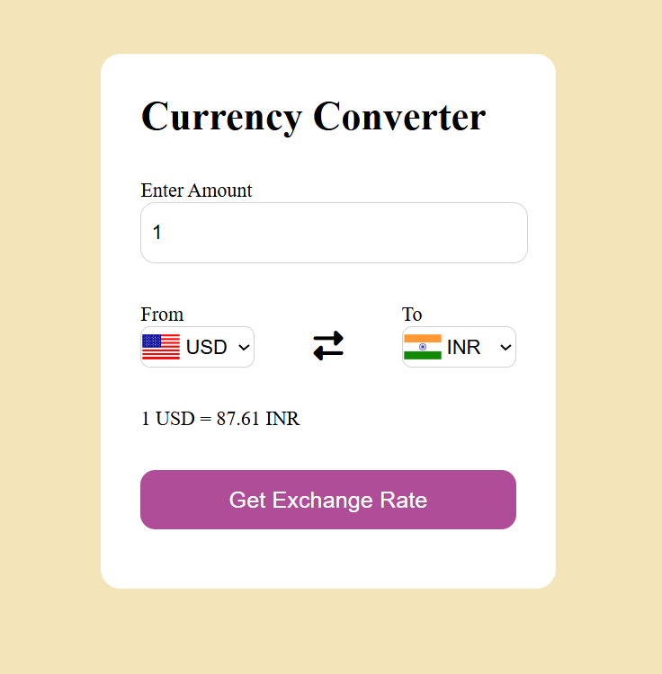

# Currency Converter (Vanilla JS)

A lightweight currency converter built with **HTML, CSS, and JavaScript**.  
Enter an amount, pick source & target currencies, and get the current conversion — all in the browser.

  

**Live Demo (GitHub Pages):** https://Sarishti845.github.io/Currency-Converter/

## ✨ Features
- Minimal, responsive UI (desktop & mobile)
- Real-time conversion on button click
- Clean, beginner-friendly code (no frameworks)
- Easy to plug into a free exchange-rate API (optional)

## 🗂️ Project Structure
.
├── index.html # Markup
├── style.css # Styles
├── codes.js # Main JS logic
└── first.js # Extra JS/helpers (if used)

markdown
Copy
Edit

## 🚀 Run Locally
**Option 1 — Open directly:** Double-click `index.html` in any modern browser.  
**Option 2 — Local server (recommended):**
- VS Code → install **Live Server** → Right-click `index.html` → *Open with Live Server*
- or Python: `python -m http.server 8000` → open `http://localhost:8000`

## 🌐 Deploy on GitHub Pages
1. Repo → **Settings → Pages**
2. **Source:** *Deploy from a branch*
3. **Branch:** `main` and **Folder:** `/ (root)` → **Save**
4. Your site will be live at: `https://Sarishti845.github.io/Currency-Converter/`

## 🔧 How it Works (High Level)
- Reads the input amount
- Reads `From` & `To` currency codes from dropdowns
- Computes/updates the rate and displays a text like: `1 USD = 87.61 INR`
- (Optional) Replace the static rate logic with a free API (e.g., Frankfurter or exchangerate.host) for live data

## 🛣️ Roadmap / Ideas
- Live rates from an API + loading/error states
- Currency flags & formatting improvements
- Dark mode toggle
- Copy result to clipboard
- Remember last-used currencies in `localStorage`

## 🧰 Tech
- **HTML5**, **CSS3**, **JavaScript (ES6)**

## 👤 Author
**Sarishti**  
- [LinkedIn](https://linkedin.com/in/sarishti-35b57b322)  

